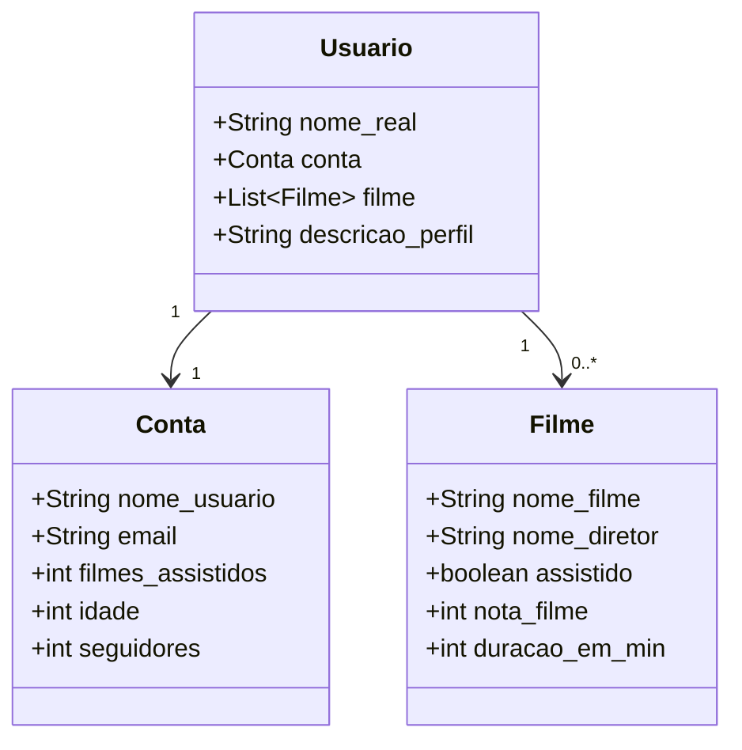

## DIAGRAMA DE CLASSES

### Para um usuário de um site de avaliação de filmes 

```mermaid
classDiagram
    class Usuario {
        +String nome_real
        +Conta conta
        +List~Filme~ filme
        +String descricao_perfil
    }

    class Conta {
        +String nome_usuario
        +String email
        +int filmes_assistidos
        +int idade
        +int seguidores
    }

    class Filme {
        +String nome_filme
        +String nome_diretor
        +boolean assistido
        +int nota_filme
        +int duracao_em_min
    }

    Usuario "1" --> "1" Conta
    Usuario "1" --> "0..*" Filme
```